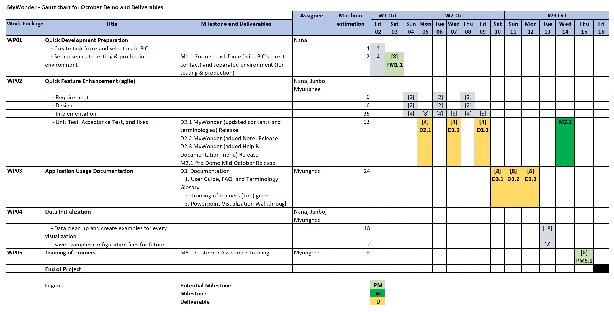

| Note                 | I create github project named MyWonder (with 2 repos named MyWonder_App and MyWonder_Documentation) under an organization named Khider&Garijo CORP (account Khider-GarijoCORP). The intention of making 2 repos instead of 1 was to simulate different teams repo assignment                                                                                                                                                                                                                                                                                                                                                                                                                                                                                                                                                                                                                                                                                                                                                                                                                                                                                                                                                                                                              |
|----------------------|-------------------------------------------------------------------------------------------------------------------------------------------------------------------------------------------------------------------------------------------------------------------------------------------------------------------------------------------------------------------------------------------------------------------------------------------------------------------------------------------------------------------------------------------------------------------------------------------------------------------------------------------------------------------------------------------------------------------------------------------------------------------------------------------------------------------------------------------------------------------------------------------------------------------------------------------------------------------------------------------------------------------------------------------------------------------------------------------------------------------------------------------------------------------------------------------------------------------------------------------------------------------------------------------|
| 1. Project Summary   | MyWonder will help user to perform big data analysis and create visualization from massive files in 10 min instead of hours using integrated cloud storage system. At the moment, users or data scientists in need of data analysis may keep their data inside their own local machine and this may impose danger of outdated version of data. Since it usually take hours to run the data analysis, or re-run it again if data were outdated, may result in users have to make a lot of preparation in their workspace long time before joining a meeting.  MyWonder will use state of the art techniques to run big data analytic and visualization efficiently. Since data were stored in cloud storage, in addition to efficiency for user to update or access files, the system surely will always compute based on the latest updated data. MyWonder can be accessed from phone to do calculations and summaries, where the result can also be stored in the system so that different user with same queries can just get result of previous user's queries, given there was no change in data. This way, we believe MyWonder will increase efficiency in data calculation and visualization.                                                                                    |
| 2. Identified Wastes | a. Wastes in project - Motion and Waiting: User have to follow a long chain of people along several teams (customer assistance, designer, developer) to get answer for their problem. This resulting in long waiting for answer and waste to meeting time. - Skills: Not involving Customer Assistance in the project so that they can familiarized themselves with contents and terminology and help answering question. - Skills: The actual person (backend developer) who’s able to make changes was not directly involved during important event such as demo. - Waiting: Need to wait very long until a fix can be executed during important event since there is no quick development procedure. - Defects: Application with difficult technical terminologies can not be used by unsavvy users and have to be changed.  b. Wastes in user process (without MyWonder) - Waiting: User have to wait hours to run data analysis. - Inventory: Keeping same copies of data at different users’ local machines is a waste of hardware storage. - Over-processed: Running same analytic queries at different users’ local machine is a waste of processing time and resource. - Transport: Have to move to workspace place to prepare data for meeting |
| 3. Issues            | Detailed tasks, labels, problem statement, and status for each issue is in GitHub - Training for Customer Assistance Team - Make Visualization Walkthrough Powerpoint Presentation - Change contents and technical terminologies to be user friendly - Make a task force for urgent change and select PIC - Separate Testing and Production Environment - Add Note feature to Visualization - Make examples of each visualization for testing and demo - Add Help & Documentation as menu and page                                                                                                                                                                                                                                                                                                                                                                                                                                                                                                                                                                                                                                                                                                                                                                |
| 4. Assign Kanban     | - (Myunghee) Training for Customer Assistance Team - (Myunghee) Make Visualization Walkthrough Powerpoint Presentation - (Myunghee) Change contents and technical terminologies to be user friendly - (Nana) Make a task force for urgent change and select PIC - (Nana) Separate Testing and Production Environment - (Junbo) Add Note feature to Visualization - (Myunghee) Make examples of each visualization for testing and demo - (Junbo) Add Help & Documentation as menu and page                                                                                                                                                                                                                                                                                                                                                                                                                                                                                                                                                                                                                                                                                                                                                                           |
| 5. Milestones        | a. Main Milestone (in scope of overall project) Pre-Demo Mid-October Release: Successfull demo is a big goal wanted to be achieved by CEO, all of his instructions are given with mind to have next successful demo throughout the week. Therefore we can consider the completion of tasks before demo as main milestone for successful demo week.  b. Potential Milestone (in scope of 2-weeks tasks) - Formed task force for quick development: The CEO would want to change many of the uncommon contents and terminologies in MyWonder. Changes can be made repetitively before each demo. Milestone allow us to define goals to achieve certain functionality where this functionality is the ability to make quick updates. In order to achieve this functionally, a direct PIC contact and separate (testing + production) environment will be needed as stated in CEO's email. - Customer Assistance Training: this extra optional potential milestone is to ensure that Customer Assistance Team can act as First Level Support when being called during demo. The preparedness of Customer Assistance Team sometimes marks whether a solution product is ready or not to be published.                                                                           |
| 6. Gantt Diagram     |                                                                                                                                                                                                                                                                                                                                                                                                                                                                                                                                                                                                                                                                                                                                                                                                                                                                                                                                                                                                                                                                                                                                                                                                                                                                                           |
| 7. Deliverables      | a. MyWonder (updated contents and terminologies) Release b. MyWonder (added Note) Release c. MyWonder (added Help & Documentation) Release d. Documentation - 1. User Guide, FAQ, and Terminology Glosary - 2. Training of Trainers (ToT) guide - 3. Powerpoint Visualization Walktrough                                                                                                                                                                                                                                                                                                                                                                                                                                                                                                                                                                                                                                                                                                                                                                                                                                                                                                                                                                                |
